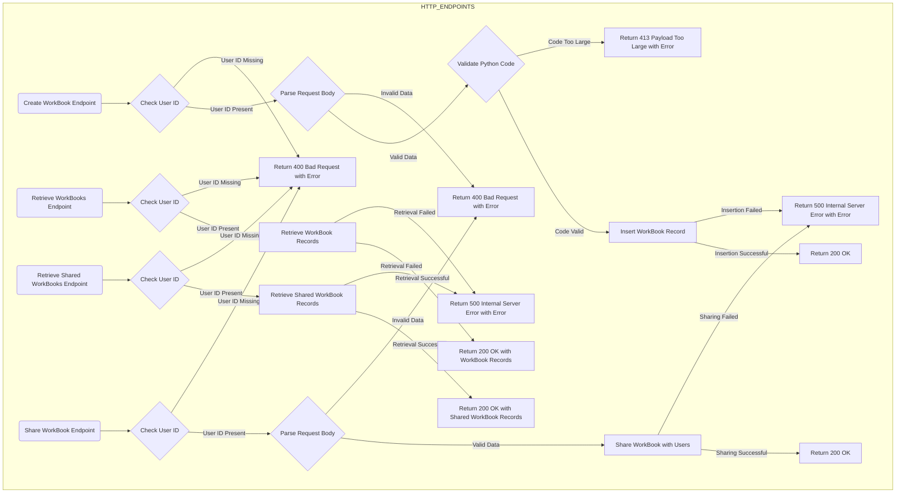
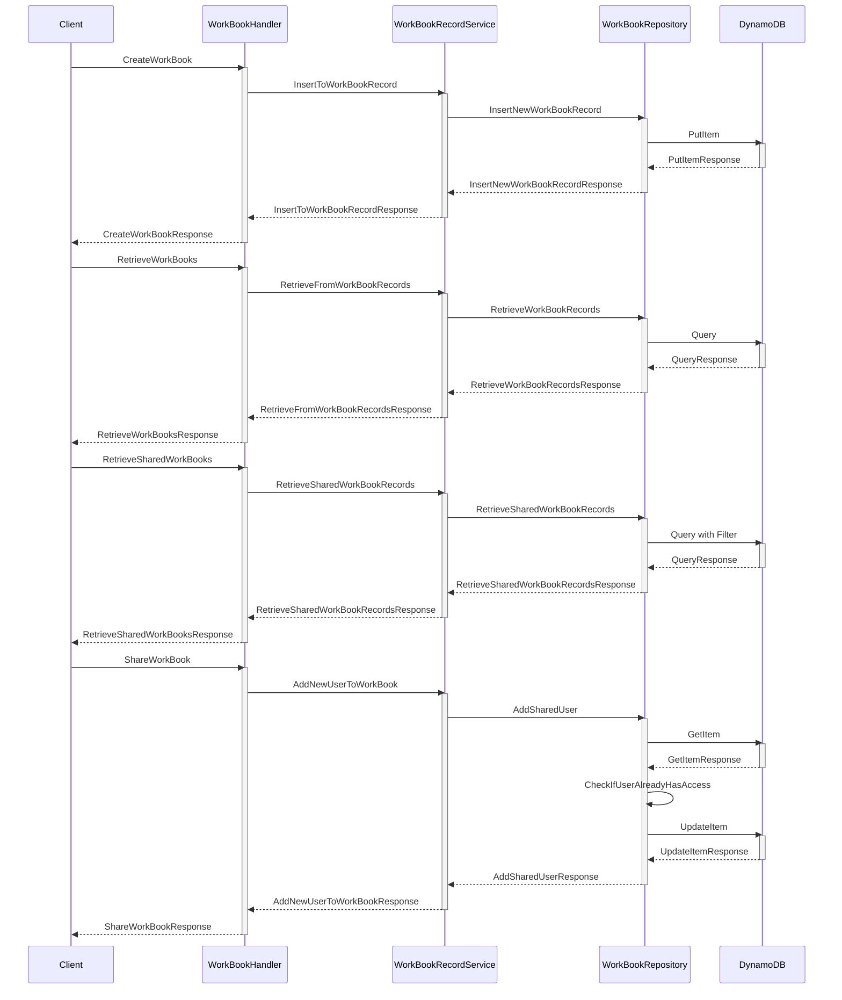
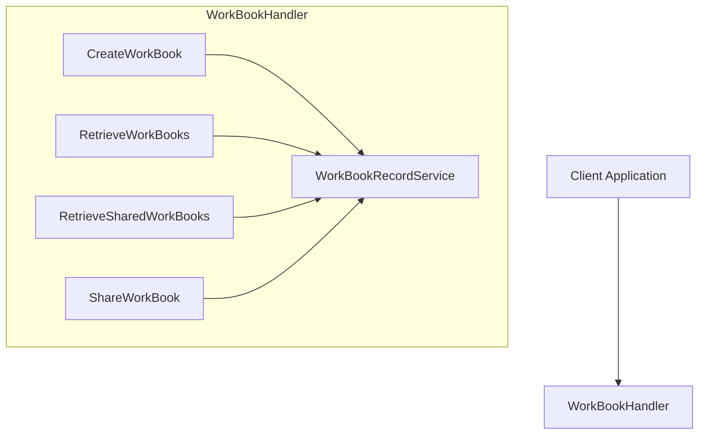
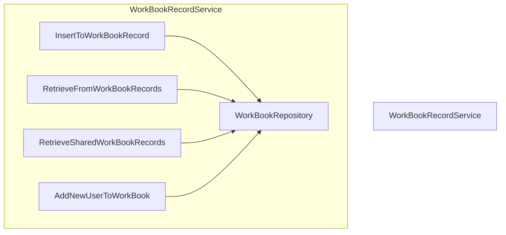
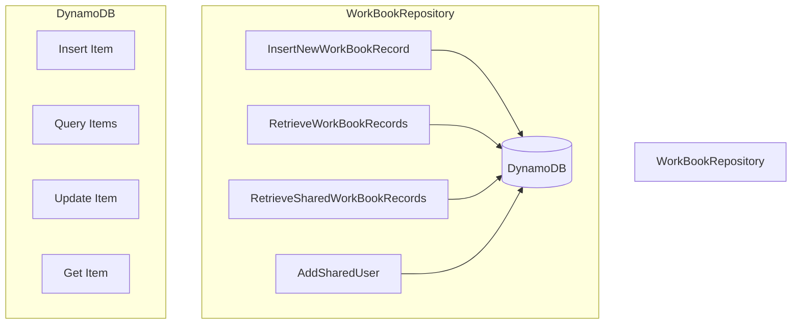

# pinkfishplatform

# Workbook Management System

## Overview

The Workbook Management System is designed to manage workbook records for users, allowing creation, retrieval, sharing, and updating of workbooks stored in AWS DynamoDB. The core components include the Client Application, WorkBookHandler, WorkBookRecordService, WorkBookRepository, and DynamoDB.

## System Architecture
### HTTP ENDPOINTS

### SYSTEM FLOW DIAGRAMM

### System Components

1. **Client Application**: Interacts with the system via HTTP endpoints.
2. **WorkBookHandler**: Processes HTTP requests and coordinates with the WorkBookRecordService.
3. **WorkBookRecordService**: Contains the business logic for managing workbooks and interacts with the WorkBookRepository.
4. **WorkBookRepository**: Interfaces with DynamoDB to perform CRUD operations.
5. **DynamoDB**: AWS DynamoDB is used as the database for storing workbook records.

### Detailed Component Design

#### 1. Client Application

The client application interacts with the system via HTTP endpoints. It sends requests to create, retrieve, share, and update workbook records.

#### 2. WorkBookHandler

The WorkBookHandler processes incoming HTTP requests and coordinates with the WorkBookRecordService. It includes the following endpoints:

- **CreateWorkBook**: Handles requests to create a new workbook.
- **RetrieveWorkBooks**: Handles requests to retrieve a user's workbooks.
- **RetrieveSharedWorkBooks**: Handles requests to retrieve workbooks shared with the user.
- **ShareWorkBook**: Handles requests to share a workbook with other users.

### WorkBookRecordService
This service contains the business logic for managing workbooks. It interacts with the WorkBookRepository to perform database operations. Key methods include:

1. **InsertToWorkBookRecord**: Validates and inserts a new workbook record.
2. **RetrieveFromWorkBookRecords**: Retrieves all workbook records for a user.
3. **RetrieveSharedWorkBookRecords**: Retrieves workbooks shared with a user.
4. **AddNewUserToWorkBook**: Adds a new user to the shared workbook's access list.

### WorkBookRepository
The repository interfaces with DynamoDB to perform CRUD operations. It includes:

1. **InsertNewWorkBookRecord**: Inserts a new workbook record into the DynamoDB table.
2. **RetrieveWorkBookRecords**: Retrieves workbook records based on user ID.
3. **RetrieveSharedWorkBookRecords**: Retrieves shared workbook records using filter expressions.
4. **AddSharedUser**: Updates a workbook record to add a new user to the shared access list.

## Detailed Sequence of Operations

### Create WorkBook Operation

1. **Client Application** sends a request to **CreateWorkBook** endpoint in **WorkBookHandler**.
2. **WorkBookHandler** calls **InsertToWorkBookRecord** in **WorkBookRecordService**.
3. **WorkBookRecordService** calls **InsertNewWorkBookRecord** in **WorkBookRepository**.
4. **WorkBookRepository** uses DynamoDB **PutItem** operation to insert the new record.

### Retrieve WorkBooks Operation

1. **Client Application** sends a request to **RetrieveWorkBooks** endpoint in **WorkBookHandler**.
2. **WorkBookHandler** calls **RetrieveFromWorkBookRecords** in **WorkBookRecordService**.
3. **WorkBookRecordService** calls **RetrieveWorkBookRecords** in **WorkBookRepository**.
4. **WorkBookRepository** uses DynamoDB **Query** operation to retrieve the records.

### Retrieve Shared WorkBooks Operation

1. **Client Application** sends a request to **RetrieveSharedWorkBooks** endpoint in **WorkBookHandler**.
2. **WorkBookHandler** calls **RetrieveSharedWorkBookRecords** in **WorkBookRecordService**.
3. **WorkBookRecordService** calls **RetrieveSharedWorkBookRecords** in **WorkBookRepository**.
4. **WorkBookRepository** uses DynamoDB **Query** operation with a filter expression to retrieve the shared records.

### Share WorkBook Operation

1. **Client Application** sends a request to **ShareWorkBook** endpoint in **WorkBookHandler**.
2. **WorkBookHandler** calls **AddNewUserToWorkBook** in **WorkBookRecordService**.
3. **WorkBookRecordService** calls **AddSharedUser** in **WorkBookRepository**.
4. **WorkBookRepository** retrieves the workbook using DynamoDB **GetItem** operation.
5. **WorkBookRepository** updates the workbook's **SharedWith** attribute using DynamoDB **UpdateItem** operation.

## Conclusion

The detailed design and sequence of operations provide a comprehensive view of how the system components interact to manage workbook records in DynamoDB. Each component's responsibilities are clearly defined, ensuring a maintainable and scalable system architecture.
